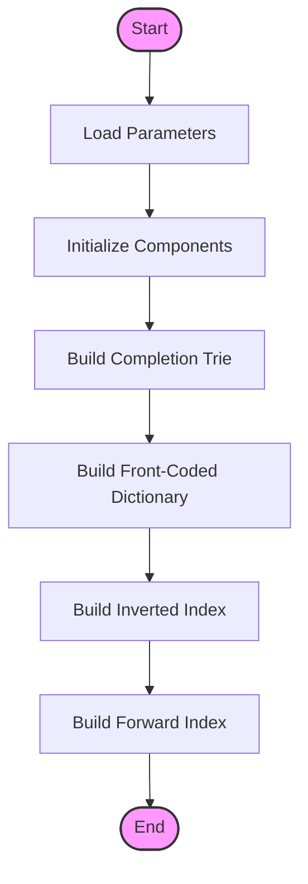
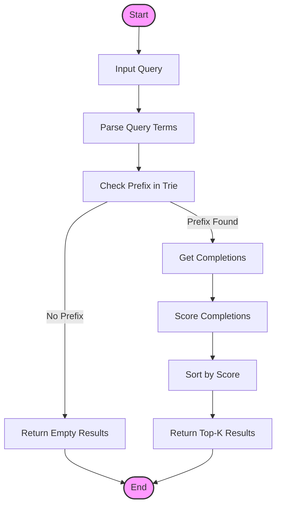
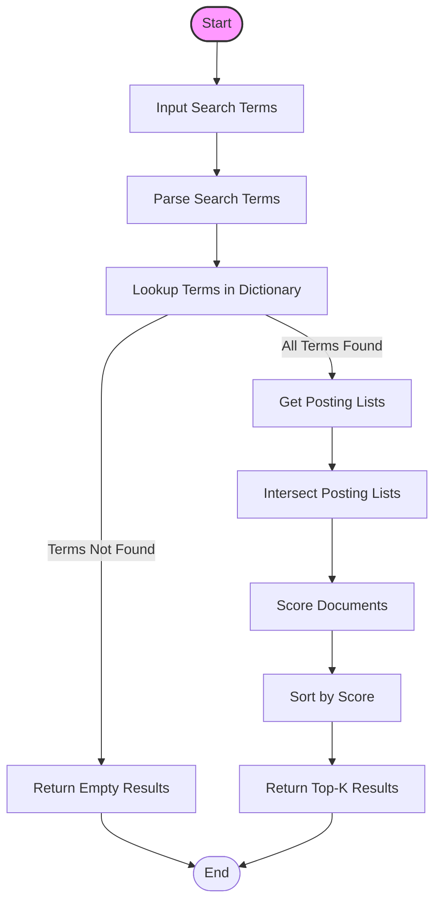
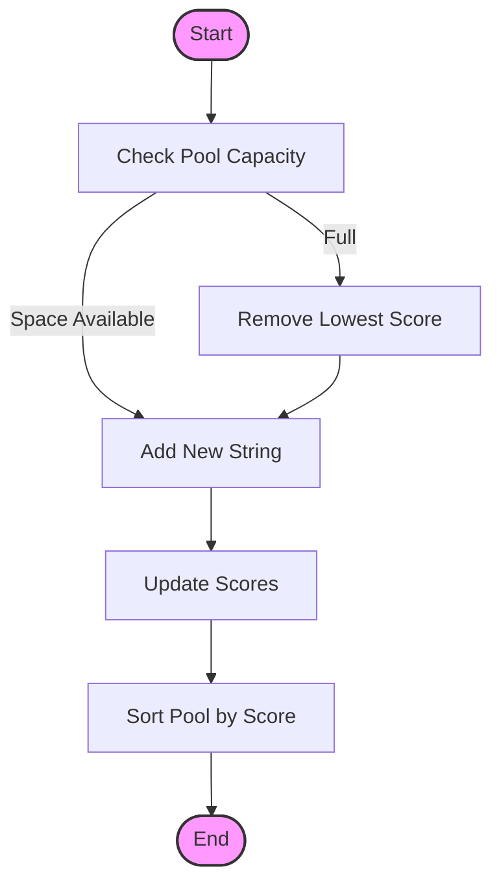
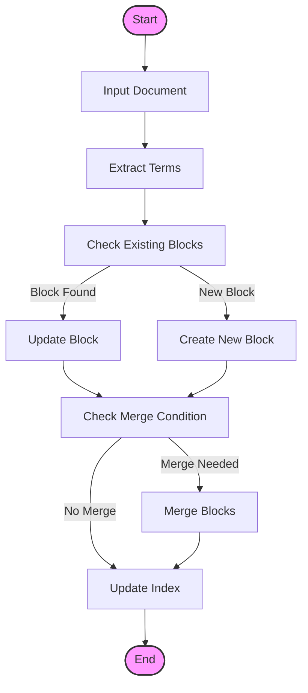
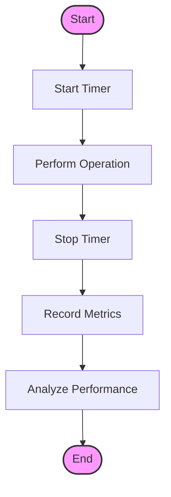

# Activity Diagrams

This document provides activity diagrams for the main workflows in the autocomplete system.

## System Initialization and Index Building

## Autocomplete Query Processing

## Search Operation Flow

## String Pool Management

## Blocked Inverted Index Operations

## Performance Measurement Flow

## Key Operations Description

### System Initialization
1. Load configuration parameters
2. Initialize core components
3. Build data structures
4. Set up indexes

### Query Processing
1. Parse and validate input
2. Check prefix in trie
3. Retrieve and score completions
4. Sort and return results

### Search Operations
1. Process search terms
2. Lookup in dictionary
3. Retrieve and intersect posting lists
4. Score and rank results

### String Pool Management
1. Maintain fixed-size pool
2. Handle insertions and removals
3. Update and sort scores
4. Manage memory efficiently

### Blocked Index Operations
1. Process document updates
2. Manage block structure
3. Handle block merges
4. Maintain index consistency

### Performance Measurement
1. Track operation timing
2. Record performance metrics
3. Analyze system behavior
4. Optimize based on results 