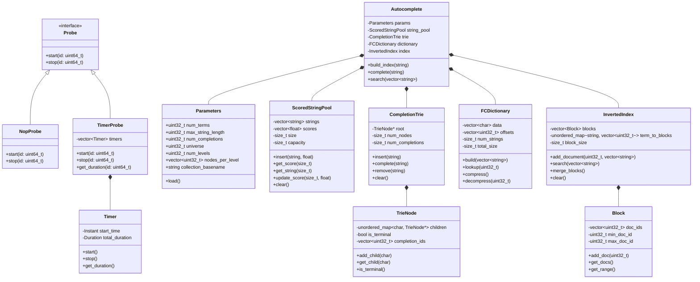
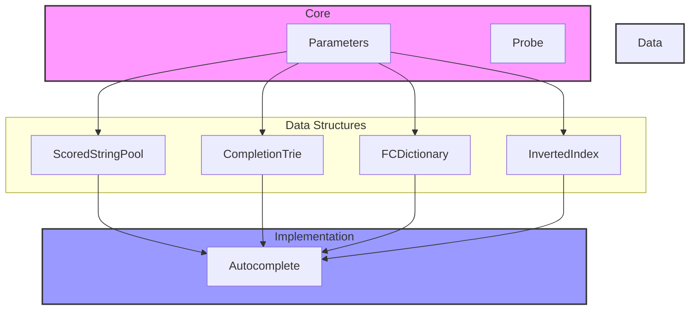
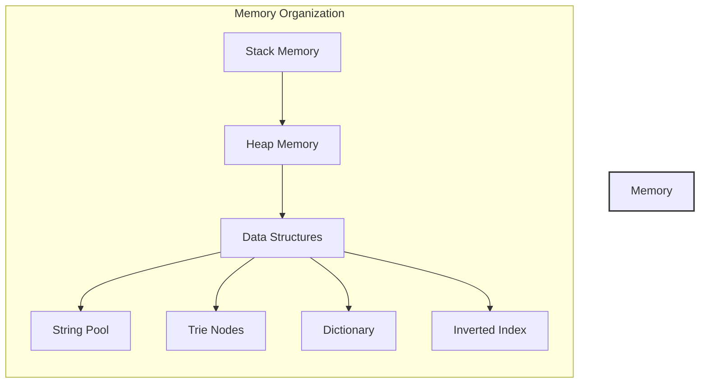

# C++ Class Diagram

This document provides a comprehensive view of all classes in the C++ implementation and their relationships.

## Main Class Diagram



## Component Dependencies



## Memory Layout



## Key Features and Methods

### Core Components
- **Parameters**: Configuration management
- **Probe**: Performance measurement interface
- **Timer**: Time tracking implementation

### Data Structures
- **ScoredStringPool**: String and score management
- **CompletionTrie**: Prefix-based completion
- **FCDictionary**: String compression
- **InvertedIndex**: Term-based search

### Main Implementation
- **Autocomplete**: Orchestrates all components

## Usage Example

```cpp
// Initialize components
Parameters params;
params.load("config.stats");

ScoredStringPool pool(POOL_SIZE);
CompletionTrie trie;
FCDictionary dict;
InvertedIndex index;

// Build autocomplete system
Autocomplete ac(params, pool, trie, dict, index);
ac.build_index("data.txt");

// Use the system
auto completions = ac.complete("hello");
auto results = ac.search({"hello", "world"});
``` 