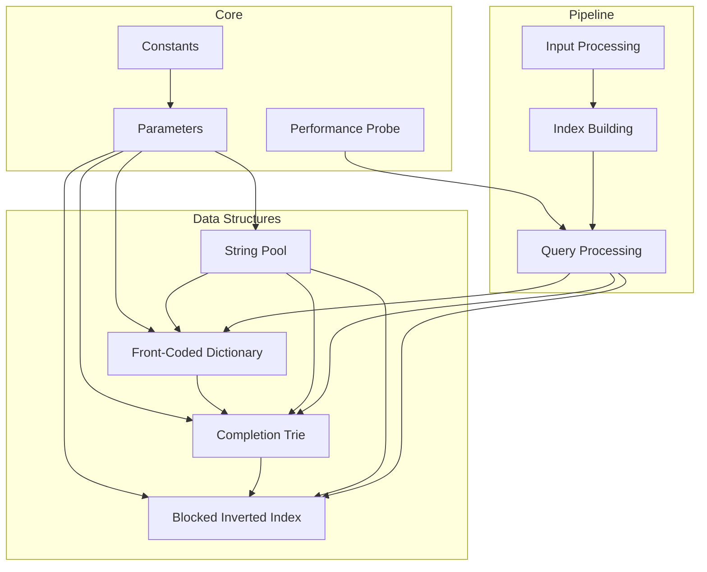

# Component Relationships

```mermaid
graph TD
    subgraph Core
        Constants[Constants]
        Parameters[Parameters]
        Probe[Performance Probe]
    end

    subgraph Data Structures
        StringPool[String Pool]
        Trie[Completion Trie]
        Dictionary[Front-Coded Dictionary]
        Index[Blocked Inverted Index]
    end

    subgraph Pipeline
        Input[Input Processing]
        Build[Index Building]
        Query[Query Processing]
    end

    %% Core Dependencies
    Constants --> Parameters
    Parameters --> StringPool
    Parameters --> Trie
    Parameters --> Dictionary
    Parameters --> Index
    Probe --> Query

    %% Data Structure Dependencies
    Dictionary --> Trie
    Trie --> Index
    StringPool --> Dictionary
    StringPool --> Trie
    StringPool --> Index

    %% Pipeline Dependencies
    Input --> Build
    Build --> Query
    Query --> Trie
    Query --> Index
    Query --> Dictionary
``` 