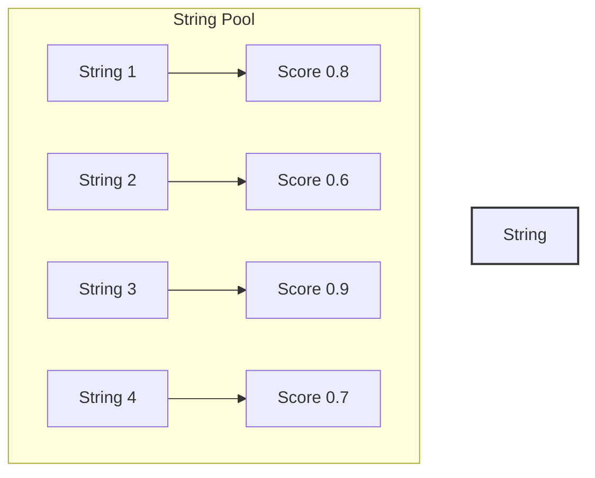
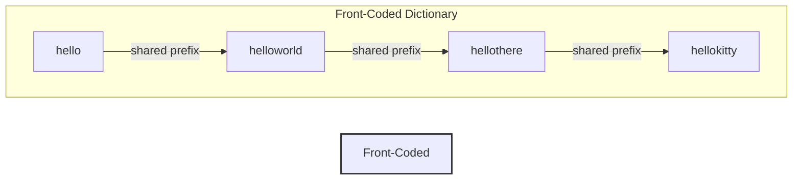
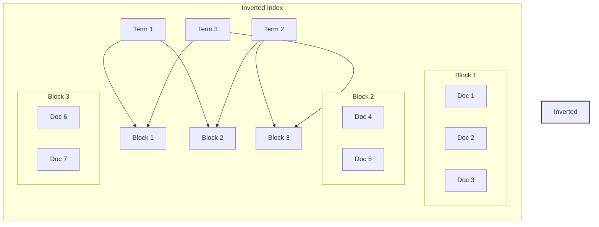

# Data Structures Documentation

This document details the key data structures used in the autocomplete system.

## 1. Scored String Pool

### Purpose
Manages a fixed-size pool of strings with associated scores, optimized for fast retrieval and updates.

### Structure
```cpp
struct scored_string_pool {
    std::vector<std::string> strings;  // String storage
    std::vector<float> scores;         // Associated scores
    size_t size;                       // Current pool size
    size_t capacity;                   // Maximum capacity
};
```

### Visualization


### Key Operations
- `insert(string, score)`: Add a new string with its score
- `get_score(index)`: Retrieve score for a string
- `get_string(index)`: Retrieve string by index
- `update_score(index, score)`: Update score for a string
- `clear()`: Reset the pool

### Memory Management
- Fixed-size allocation to prevent reallocations
- Contiguous memory layout for cache efficiency
- Score and string data stored separately for better cache utilization

## 2. Completion Trie

### Purpose
Efficient prefix-based string completion using a trie data structure.

### Structure
```cpp
struct trie_node {
    std::unordered_map<char, trie_node*> children;
    bool is_terminal;
    std::vector<uint32_t> completion_ids;
};

struct completion_trie {
    trie_node* root;
    size_t num_nodes;
    size_t num_completions;
};
```

### Visualization


### Key Operations
- `insert(completion)`: Add a new completion string
- `complete(prefix)`: Find all completions for a prefix
- `remove(completion)`: Remove a completion string
- `clear()`: Reset the trie

### Optimizations
- Path compression for common prefixes
- Node sharing for similar completions
- Lazy deletion for better performance

## 3. Front-Coded Dictionary

### Purpose
Compressed string dictionary using front-coding technique.

### Structure
```cpp
struct fc_dictionary {
    std::vector<char> data;           // Compressed string data
    std::vector<uint32_t> offsets;    // String offsets
    size_t num_strings;               // Number of strings
    size_t total_size;                // Total compressed size
};
```

### Visualization


### Key Operations
- `build(strings)`: Build dictionary from string list
- `lookup(id)`: Retrieve string by ID
- `compress()`: Apply front-coding compression
- `decompress(id)`: Decompress a specific string

### Compression Details
- Common prefixes shared between consecutive strings
- Variable-length encoding for shared prefix lengths
- Delta encoding for string differences

## 4. Blocked Inverted Index

### Purpose
Efficient term-based search using blocked inverted indexing.

### Structure
```cpp
struct block {
    std::vector<uint32_t> doc_ids;    // Document IDs in block
    uint32_t min_doc_id;              // Minimum doc ID in block
    uint32_t max_doc_id;              // Maximum doc ID in block
};

struct inverted_index {
    std::vector<block> blocks;        // Index blocks
    std::unordered_map<std::string, std::vector<uint32_t>> term_to_blocks;
    size_t block_size;                // Size of each block
};
```

### Visualization


### Key Operations
- `add_document(doc_id, terms)`: Add document to index
- `search(terms)`: Find documents containing terms
- `merge_blocks()`: Optimize block structure
- `clear()`: Reset the index

### Blocking Strategy
- Fixed-size blocks for predictable memory usage
- Block-level compression for space efficiency
- Skip pointers for faster traversal

## Memory and Performance Considerations

### Memory Layout
1. **Contiguous Storage**
   - Strings stored in contiguous memory
   - Scores aligned for SIMD operations
   - Block data packed efficiently

2. **Cache Optimization**
   - Hot data kept together
   - Cold data separated
   - Alignment for cache lines

### Performance Optimizations
1. **String Operations**
   - String interning for deduplication
   - Small string optimization
   - Custom string comparison

2. **Search Optimizations**
   - Block-level skipping
   - Term frequency caching
   - Result set intersection optimization

3. **Memory Management**
   - Custom allocators for specific structures
   - Memory pooling for frequent allocations
   - Lazy initialization where appropriate

## Usage Examples

### String Pool Usage
```cpp
scored_string_pool pool(POOL_SIZE);
pool.insert("completion1", 0.8);
pool.insert("completion2", 0.6);
auto completions = pool.get_top_k(10);
```

### Trie Usage
```cpp
completion_trie trie;
trie.insert("hello world");
trie.insert("hello there");
auto results = trie.complete("hello");
```

### Dictionary Usage
```cpp
fc_dictionary dict;
dict.build(strings);
auto str = dict.lookup(42);
```

### Index Usage
```cpp
inverted_index index;
index.add_document(1, {"term1", "term2"});
auto docs = index.search({"term1", "term2"});
``` 